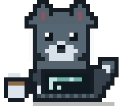

<!--
  ─────────────────────────────────────────────────────────────
  KURULUM
  1. github.com/new  ->  repo adi: ramazankudret   (public, README isaretli)
  2. Bu klasorun icerigini o reponun kokune koy:
        README.md
        assets/header.svg
        assets/cuda-canvas.svg
        assets/erk-coding.svg
  3. MAIL_ADRESIN ve LINKEDIN_KULLANICI_ADIN degistir.
  4. Settings -> Public profile -> "Include private contributions
     on my profile" -> ACIK   (yesil kareler private commit'lerinle dolar)
  ─────────────────────────────────────────────────────────────
-->



<br>

Computer Engineering senior. I work at the layer where hardware stops being an
abstraction — GPU memory, kernel launches, cache behaviour, and latency budgets
you can't miss.

- **Founder of ERK Security** — security & AI tooling: LLM-backed threat analysis,
  GPU inference pipelines, and a reflexive P4 data plane with an ML control plane.
- **Building GPUFlow** — live visualization of what every process is actually doing
  on your GPU. C++17, passive NVML sampling, dependency-free SSE server, zero-install
  browser UI.
- **Edge perception** — anomaly detection on Jetson AGX Orin + ZED 2i for UAV workloads.
- **Going deep on** — CUDA memory hierarchy, TensorRT optimization, multi-target
  tracking, modern C++ concurrency.

<br>



<br>

### Toolbox

```text
Systems     C++17/20 · CUDA · NVML · pybind11 · CMake · Linux · Assembly (MIPS/PIC)
Inference   TensorRT  · ONNX · PyTorch
Perception  Kalman filtering · multi-target tracking · signal processing · ZED SDK
Security    P4/bmv2 · Mininet · adversarial ML · network asset discovery
```

<br>

<table>
<tr>
<td width="290" valign="middle">
  
</td>
<td valign="middle">

**Right now**

Tiled SGEMM on Ada, chasing the gap between 8.4 and 11.6 TFLOP/s.
Shared-memory bank conflicts, register pressure, and the eternal
question of whether the bottleneck is the kernel or the copy.

*Spoiler: it is almost always the copy.*

</td>
</tr>
</table>

<br>

<p align="center">
  <a href="https://www.linkedin.com/in/LINKEDIN_KULLANICI_ADIN"></a>
  <a href="mailto:MAIL_ADRESIN"></a>
</p>


<!--
==========================================================================
  HAZIR AMA KAPALI — her birinin ne zaman acilacagi yaninda yaziyor.
==========================================================================

--- YILAN ---------------------------------------------------------------
Katki grafigindeki kareleri yiyen yilan. .github/workflows/snake.yml ekle
(Platane/snk@v3). "Include private contributions" acikken repo public
olmadan da dolu gorunur — senin durumunda en kazancli eklenti bu.

<picture>
  <source media="(prefers-color-scheme: dark)" srcset="https://raw.githubusercontent.com/ramazankudret/ramazankudret/output/github-snake-dark.svg">
  
</picture>


--- AKTIVITE GRAFIGI ----------------------------------------------------
Birkac hafta commit birikmeden acma, duz cizgi kotu durur.


--- STATS KARTI ---------------------------------------------------------
Reposu 65 bin+ yildizli, profillerin yarisinda ayni kart var; 2026'da
"sablon" gibi okunuyor ve rate-limit yiyip kirik resim cikarabiliyor.
Koyacaksan tek tane koy.


--- GPUFLOW PUBLIC OLUNCA ----------------------------------------------
Yukaridaki "Building GPUFlow" satirini linke cevir ve pinned repo
ayarindan one al. Repo README'sinin en ustune demo GIF koymayi unutma.

==========================================================================
-->
